# Fast Style Transfer 🏎💨🖌️🎨🧠

To navigate where you want to go, here are the contents:
- [Background 📖📕](#background-📖📕)
- [Results 😎](#results-😎)
- [Control and TradeOffs ⚖️](#control-and-tradeoffs-⚖️)
- [Video Stylization 🎥🖌️](#video-stylization-🎥🖌️)
- [Comparison with Optimization Based Method](#comparison-with-optimization-based-method)
- [Setting This Up On Your Computer](#setting-this-up-on-your-computer)
- [How To Style Your Image Or Video](#how-to-style-your-image-or-video)
- [How To Train Your Own Model](#how-to-train-your-own-model)

## Background 📖📕
In this repository, I will do a PyTorch implemention of the fast neural style transfer algorithm described in the paper [Perceptual Losses for Real-Time Style Transfer
and Super-Resolution](https://cs.stanford.edu/people/jcjohns/eccv16/) by Justin Johnson, Alexandre Alahi, and Li Fei-Fei.

This method essentially involves training a model to **approximate** the [optimization based neural style transfer](https://github.com/igreat/artistic-style-net). The benefit is that it runs about 3 orders of magnitude faster!

Because of its improved inference time, it's feasible to run style transfer in real time as you'll also see in this repository.

<div align="center">
    
    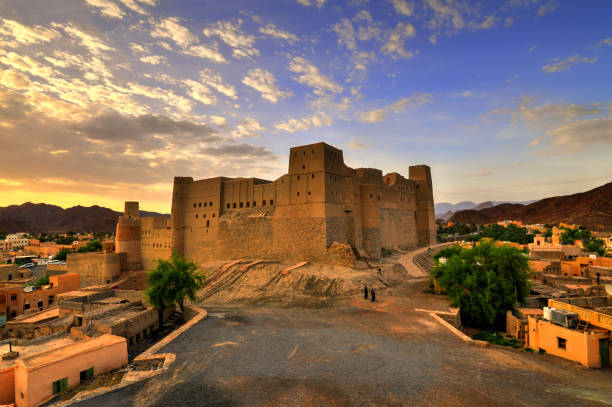
    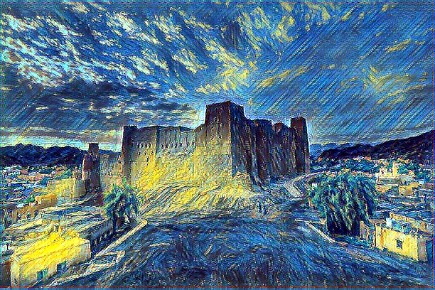
</div>

## Results 😎

<!-- original images -->
<p align="center">
    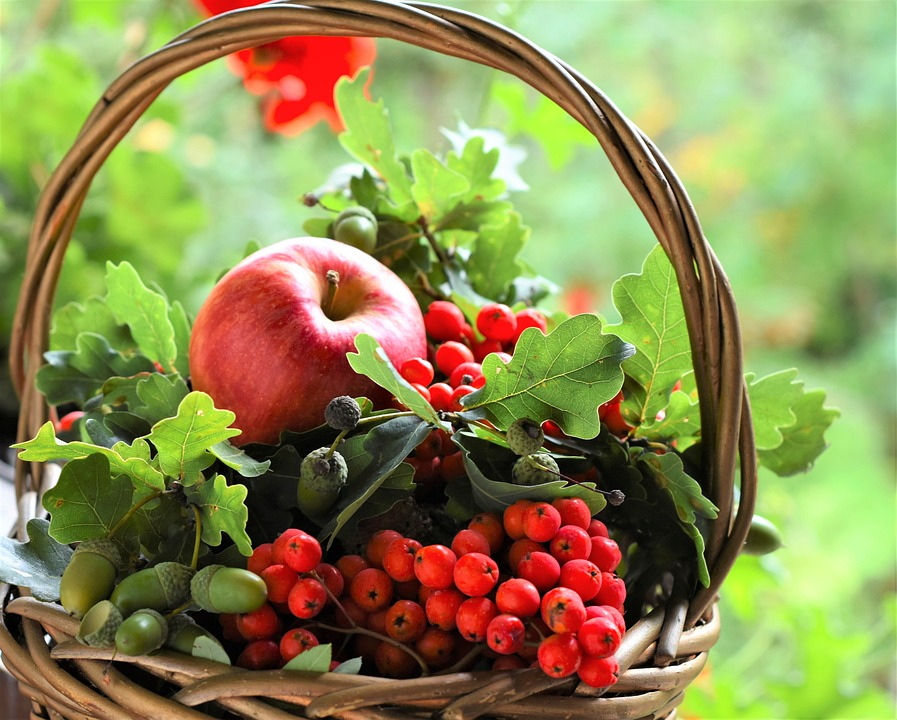
    


<!-- starry night -->
<p align="center">
    
    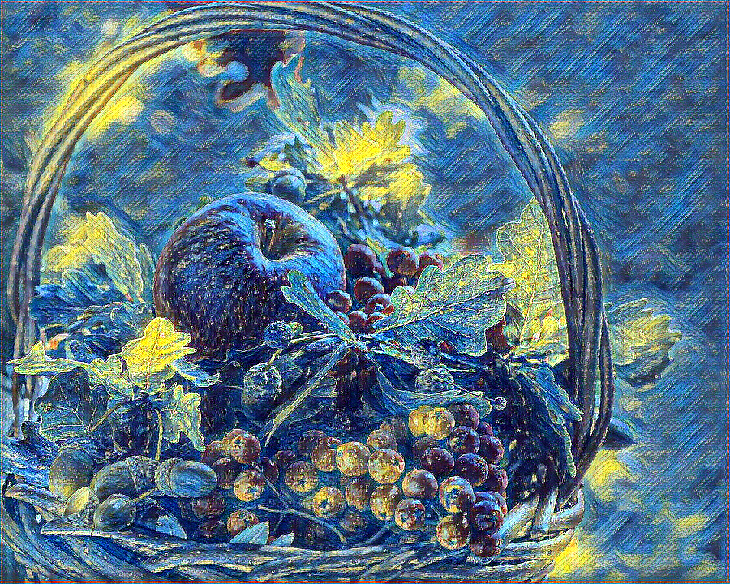
    
</p>

<!-- rain princess -->
<p align="center">
    
    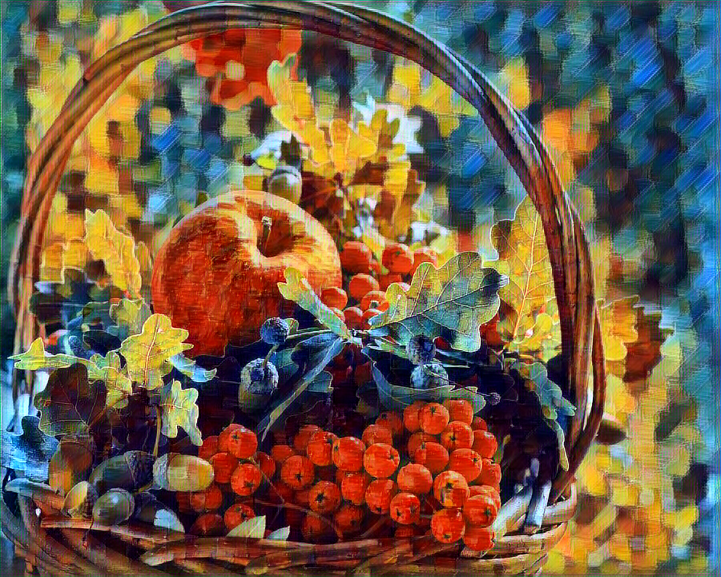
    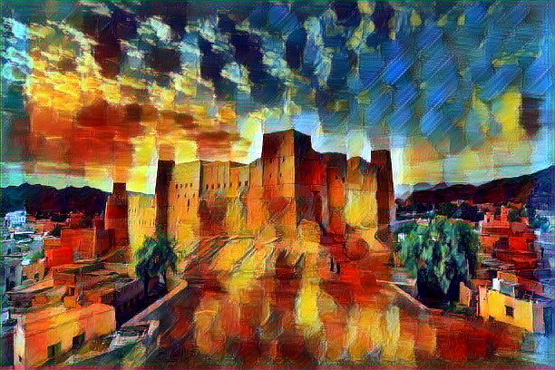
</p>

<!-- abstract dalle -->
<p align="center">
    
    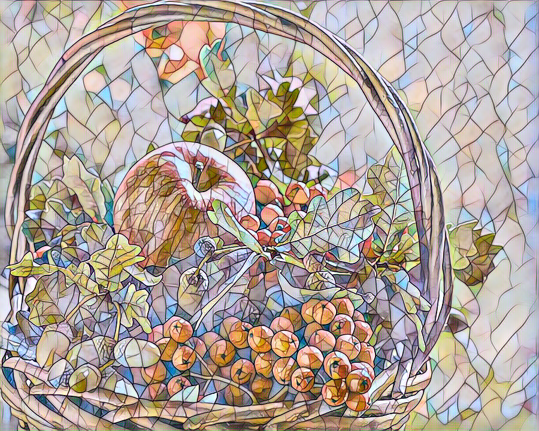
    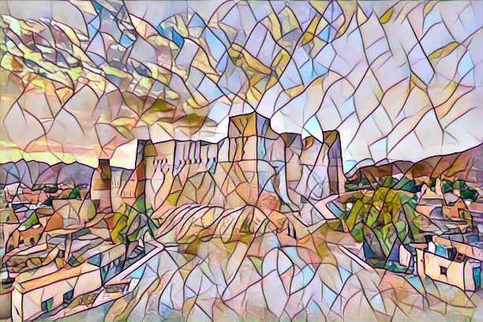
</p>

<!-- abstract dalle -->
<p align="center">
    
    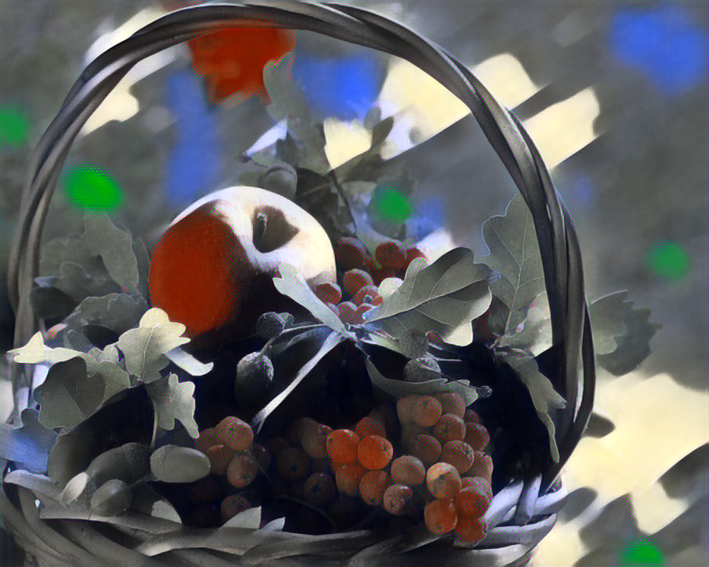
    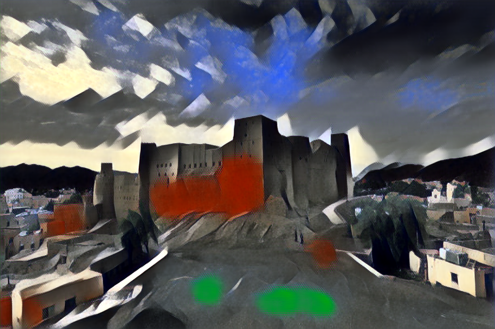
</p>

## Control and Tradeoffs ⚖️
Training the model involves a bunch of hyperparameters which include:
- Style weight
- Content weight
- TV regularization to improve smoothness

I've found that when leaving the content weight as 1e2, a style weight ranging from 1e7 or 1e8 works well, but it depends on the style image.

Though I've kept the total variation regulizer, I found that leaving its weight at 0 (disabling it) yields consistently better results. However, perhaps if it's sufficiently small it can be good (the lua implementation from the original paper had it).

## Video Stylization 🎥🖌️

<!-- stylized gifs -->
<p align="center">
    
    
    
</p>

Because of its vastly improved inference time, we can run fast neural style transfer in videos, even in real time!

## Comparison with Optimization Based Method

Though fast neural style transfer runs about three orders of magnitude faster than its optimization-based counterpart, it produces noticebly less quality styled images.

<!-- starry night -->
<p align="center">
    
    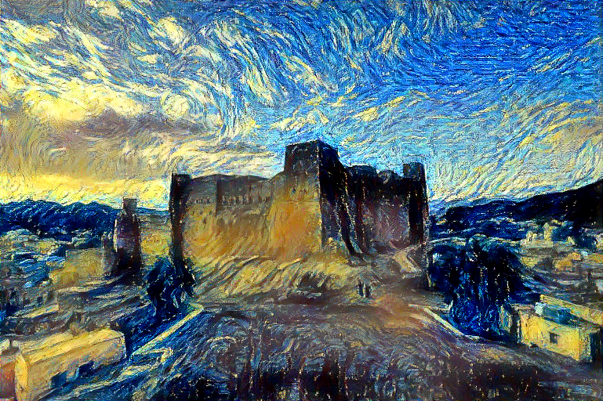
    
</p>

<!-- rain princess -->
<p align="center">
    
    
    
</p>

## Setting This Up On Your Computer
Soon to be implemented 💪 (I just need to package all dependencies into a file for people to download)
<!-- TODO: package all dependencies into a yaml file -->

## How To Style Your Image Or Video
You'll have to first navigate to the project file in your terminal.
### Stylize Your Image
To style your own image, here is the most basic command you can write:
```
python stylize_image.py --image_path {PATH TO YOUR VIDEO} --pretrained_model {ONE OF MY PRETRAINED MODELS}
```
For example, to generate bahla's fort in the style of the starry night, you have to type the following command:
```
python stylize_image.py --image_path images/content_images/bahla-fort.jpg --pretrained_model starry_night
```

For more options, here's what the help message gives:
```
usage: Stylize an image [-h] --image_path IMAGE_PATH [--image_size IMAGE_SIZE] [--pretrained_model {starry_night,rain_princess,abstract,mosaic}]
                        [--model_path MODEL_PATH] [--save_path SAVE_PATH]

optional arguments:
  -h, --help            show this help message and exit
  --image_path IMAGE_PATH
                        path to the image to be stylized
  --image_size IMAGE_SIZE
                        size of the image to be stylized. if not specified, the image will not be resized
  --pretrained_model {starry_night,rain_princess,abstract,mosaic}
                        pretrained model to be used for stylizing the image
  --model_path MODEL_PATH
                        path to the model to be used for stylizing the image
  --save_path SAVE_PATH
                        path to save the stylized image
```
Note that either a pretrained model or a model path need to be specified.

### Stylize Your Video

To stylize your own video, here is the most basic command you can write:
```
python stylize_video.py --video_path {PATH TO YOUR VIDEO} --pretrained_model {ONE OF MY PRETRAINED MODELS}
```
For example, to generate a video of cat jumping in the style of the starry night, you have to type the following command:
```
python stylize_video.py --video_path videos/source_videos/jumping_cat.mp4 --pretrained_model starry_night
```

For more options, here is what the help message gives:
```
usage: Stylize a video [-h] --video_path VIDEO_PATH [--pretrained_model {starry_night,rain_princess,abstract,mosaic}] [--model_path MODEL_PATH]
                       [--save_path SAVE_PATH] [--frames_per_step FRAMES_PER_STEP] [--max_image_size MAX_IMAGE_SIZE]

optional arguments:
  -h, --help            show this help message and exit
  --video_path VIDEO_PATH
                        path to the video to be stylized
  --pretrained_model {starry_night,rain_princess,abstract,mosaic}
                        pretrained model to be used for stylizing the video
  --model_path MODEL_PATH
                        path to the model to be used for stylizing the video
  --save_path SAVE_PATH
                        path to save the stylized video
  --frames_per_step FRAMES_PER_STEP
                        number of frames to transform at a time. higher values will be faster but will result in signficantly more memory usage
  --max_image_size MAX_IMAGE_SIZE
                        maximum size of dimensions of the video frames. if not specified, the frames will not be resized
```
## How To Train Your Own Model

I've also provided an interface for you to train your own model from scratch. Note that this is very computationally heavy, and unless you have a good GPU and good RAM (12+ GB), be ready for your computer to be taken hostage by the training process.

You'll have to download a large image dataset on your computer to train on. The orignal paper used a subset of the 2014 [MS-COCO test dataset](https://cocodataset.org/#download) (80k images) and trained for two epochs. Because all I have is an M1 macbook air, I only trained my models for only one epoch, but the results *mostly* converged.

Here is the most simple command to train a model:
```
python train_model.py --style_image_path {PATH TO YOUR STYLE IMAGE} --train_dataset_path {PATH TO DATASET}
```
For example, to train a model on the 2014 ms-coco datset to transform an image to the style of the starry night, you have to type the following command:
```
python train_model.py --style_image_path images/style_images/starry_night.jpg --train_dataset_path data/mscoco
```

You can also monitor the training of your model through tensorboard by typing the following in your terminal:

```
tensorboard --logdir=runs --samples_per_plugin images={MAX IMAGES}
```

Note you'll need multiple terminals for this: one for training your model and one for the tensorboard. I used the terminals provided in VSCODE for the training and my default terminal for tensorboard. 

For more options, here is what the help message gives:
```
usage: Train a model [-h] --style_image_path STYLE_IMAGE_PATH [--train_dataset_path TRAIN_DATASET_PATH] [--save_path SAVE_PATH] [--epochs EPOCHS]
                     [--batch_size BATCH_SIZE] [--image_size IMAGE_SIZE] [--style_size STYLE_SIZE] [--style_weight STYLE_WEIGHT] [--content_weight CONTENT_WEIGHT]
                     [--tv_weight TV_WEIGHT] [--learning_rate LEARNING_RATE] [--checkpoint_path CHECKPOINT_PATH] [--checkpoint_interval CHECKPOINT_INTERVAL]
                     [--device {cpu,cuda,mps}]

optional arguments:
  -h, --help            show this help message and exit
  --style_image_path STYLE_IMAGE_PATH
                        path to the style image
  --train_dataset_path TRAIN_DATASET_PATH
                        path to the training dataset
  --save_path SAVE_PATH
                        path to save the trained model
  --epochs EPOCHS       number of epochs to train the model for
  --batch_size BATCH_SIZE
                        batch size to train the model with
  --image_size IMAGE_SIZE
                        image size to train the model with
  --style_size STYLE_SIZE
                        style size to train the model with. if not specified, the orignal size will be used
  --style_weight STYLE_WEIGHT
                        weight of the style loss
  --content_weight CONTENT_WEIGHT
                        weight of the content loss
  --tv_weight TV_WEIGHT
                        weight of the total variation loss
  --learning_rate LEARNING_RATE
                        learning rate to train the model with
  --checkpoint_path CHECKPOINT_PATH
                        path to the checkpoint to resume training from. If not specified, training will start from scratch
  --checkpoint_interval CHECKPOINT_INTERVAL
                        number of images to train on before saving a checkpoint. keep it a multiple of the batch size
  --device {cpu,cuda,mps}
                        device to train the model on
```
